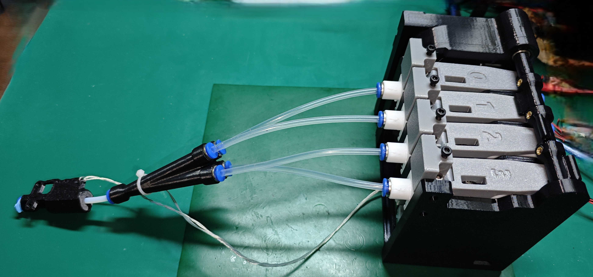
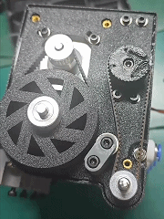

# MMX AOMING Remix
## 简介

原始工程
https://www.printables.com/model/1181017-mmx-multi-material-extruder-exclusive-final-releas

### 主要修改点
- 圆角调整为倒角, 便于打印和二次修改
- 调整凸轮轴固定方式, 现在轴承固定在中间的板上, 不用侧盖也能正常工作了
- 使用16T同步轮或20T同步轮代替凸轮轴打印的同步轮
- 增加弹簧下压机构, 可以调节下压力度, 且维护BMG齿轮不用再拆开整个机器了
- 修改舵机主动轮, 通过与注塑的舵机主动轮结合, 更不容易打滑, 且可以使用开口同步带替换闭口同步带
- 绘制了基于RP2040的专用主板 - https://oshwhub.com/aoming/3d-da-yin-mmx-duo-se-zhu-ban

### 打印注意事项
- 建议使用PETG进行打印
- 建议使用Voron结构件打印参数进行打印
    - 顶底5层, 壁厚4, 填充40%
- 请自行观察模型, 加上支撑

## 交流QQ群
1027251200
